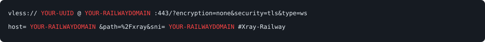

# XRAY VLESS WebSocket TLS on Railway

Deploy **XRAY VLESS WebSocket TLS** on [Railway](https://railway.com/).

This project allows you to run an **Xray VLESS server with WebSocket and TLS** on Railway.

## 🚀 Deploy

GitHub Repository:

Deploy the repository to Railway.

After deployment, follow the steps below.

---

## 1. Generate Domain

After deploying the project on Railway:

Go to:

**Settings → Networking → Generate Domain**

Railway will generate a public domain for your service.

For example:

```text
your-project.up.railway.app
```

Copy this domain. You will need it for the VLESS configuration.

---

## 2. Add UUID Variable

In your Railway service, go to:

**Variables**

Add the following variable:

```text
Name: UUID
Value: YOUR-UUID
```

Example:

```text
UUID=xxxxxxxx-xxxx-xxxx-xxxx-xxxxxxxxxxxx
```

Replace `YOUR-UUID` with your own UUID.

---

## 3. VLESS Configuration

Use the following settings in your VLESS client:

```text
Protocol: VLESS

Address: YOUR-RAILWAY-DOMAIN
Port: 443

UUID: YOUR-UUID
Encryption: none

Network: WebSocket
Path: /xray
Host: YOUR-RAILWAY-DOMAIN

Security: TLS
SNI: YOUR-RAILWAY-DOMAIN
```

### Configuration Example

```text
Protocol: VLESS
Address: example.up.railway.app
Port: 443

UUID: xxxxxxxx-xxxx-xxxx-xxxx-xxxxxxxxxxxx
Encryption: none

Network: WebSocket
Path: /xray
Host: example.up.railway.app

Security: TLS
SNI: example.up.railway.app
```

---

## 4. VLESS URI

You can use the following VLESS URI format:

```text

vless://YOUR-UUID@YOUR-RAILWAY-DOMAIN:443?encryption=none&security=tls&type=ws&host=YOUR-RAILWAY-DOMAIN&path=%2Fxray&sni=YOUR-RAILWAY-DOMAIN#XRAY-Railway

```





Replace:

```text
YOUR-UUID
```

with your UUID.

And replace:

```text
YOUR-RAILWAY-DOMAIN
```

with the domain generated by Railway.

### Example

```text
vless://xxxxxxxx-xxxx-xxxx-xxxx-xxxxxxxxxxxx@example.up.railway.app:443?encryption=none&security=tls&type=ws&host=example.up.railway.app&sni=example.up.railway.app&path=%2Fxray#XRAY-Railway
```

---

## ⚙️ Configuration Summary

| Setting        | Value          |
| -------------- | -------------- |
| Protocol       | VLESS          |
| Address        | Railway Domain |
| Port           | `443`          |
| UUID           | Your UUID      |
| Encryption     | `none`         |
| Network        | WebSocket      |
| WebSocket Path | `/xray`       |
| WebSocket Host | Railway Domain |
| Security       | TLS            |
| TLS            | Enabled        |
| SNI            | Railway Domain |

---

## 📱 Compatible Clients

This configuration can be used with Xray-compatible clients such as:

* v2rayNG
* NekoBox
* NekoRay
* Other VLESS-compatible clients

---

## ⚠️ Important

Make sure the following values are correct:

1. The `UUID` in Railway must be the same UUID used in your VLESS client.
2. `Address` must be your Railway generated domain.
3. `Host` must be your WebSocket Host.
4. `SNI` must be your TLS Server Name.
5. WebSocket Path must be:

```text
/xray
```

6. TLS must be **Enabled**.
7. The connection port is:

```text
443
```

---

## 🔧 Railway Settings

After deployment:

```text
Railway
  └── Your Project
      └── Your Service
          ├── Settings
          │   └── Networking
          │       └── Generate Domain
          │
          └── Variables
              └── UUID=YOUR-UUID
```

---

## 🔐 Security

Do not publish your UUID if you want to keep your VLESS configuration private.

If your UUID has been exposed publicly, generate a new UUID and update the `UUID` variable in Railway.

---

## Credits

* [Xray-core](https://github.com/XTLS/Xray-core)
* [Railway](https://railway.com/)

## License

This project is provided as-is for educational and personal use.


